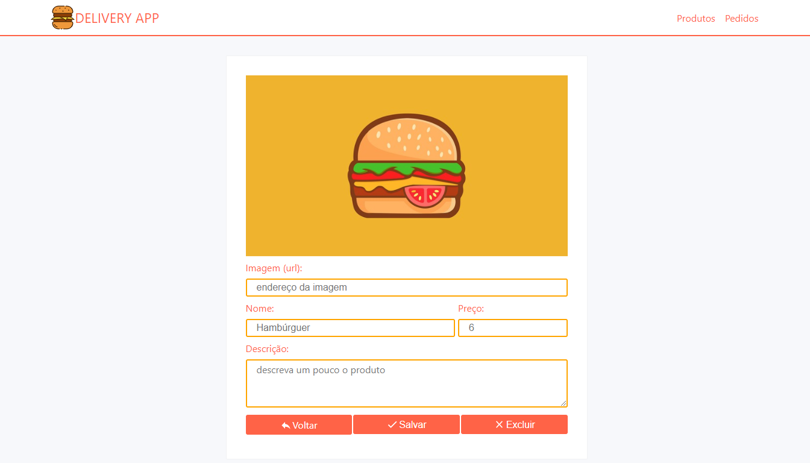

# :hamburger: Sistema de Delivery
Pequeno projeto de um sistema de *delivery*. Se trata de uma plataforma integrada a uma API que permite o cadastro de produtos e o gerenciamento de pedidos em tempo real.

:star: **Recursos**:

- API com conexão com banco de dados SQL.
- Plataforma web SPA para gerencimanto de produtos e pedidos.

**:rocket: Tecnologias:**

- [Node JS](https://nodejs.org/en/)
- [React JS](https://pt-br.reactjs.org/)
- [PostgreSQL](https://www.postgresql.org/)

**:package: Bibliotecas:**
- [Express](https://expressjs.com/pt-br/)
- [React Router](https://reacttraining.com/react-router/web/)
- [Sequelize](https://sequelize.org/)
- [Axios](https://github.com/axios/axios)

---

:coffee: Desenvolvido por Daniel Santos

